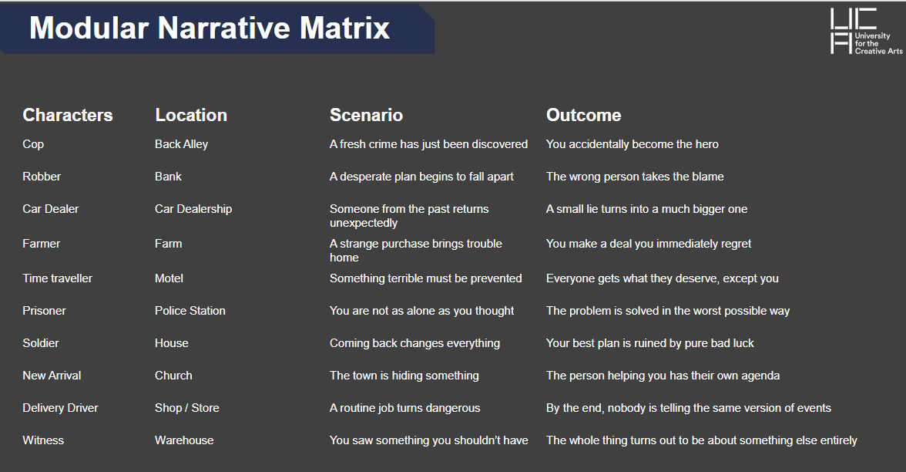
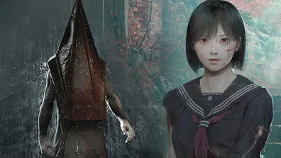

# Interactive Narrative Game

**FGCT4007: Interactive Narratives 25/26**

**Student Name**: Zuzanna Maria Pawelczyk

**Student ID**: 2506784

**Total Word Count**:

**Build Link**:

**Video Demonstration link**:

## Abstract

My task was to create a interactive narrative game in a group within four weeks using a mix and match of four different groups of options for the guideline of what are game should be. As a group we delegated on what to pick, so before picking the options we wanted a bottom line for what genre the game should be. We decided to make a horror game so we picked options with that in mind.

Originally we picked:
- Cop
- Church
- The town is hiding something
- The wrong person takes the blame

However, when later creating the story for the game, the last choice was changed to:
- The person helping you has their agenda. 

The basis of our game is that the player is a cop that is sent to investigate a town with suspicious activity and disapearances, upon arival the cop investigates the lone church as it's the only one with visible activity (lights being on). Upon investigating the church they find a secret entrance to an underground area behind the lectern. The player enters into the underground and stumble across a prisoner that lets them know of a key further inside the underground to rescue them. They then go further into the level, shooting enemy cultist, complete a puzzle and kill the boss before recieving the key, returning to the prisoner and being able to choose if they want to free the prisoner. If the player is able to find notes that key them in on the fact that the prisoner has some sort of parasite that will bring on the end of the world when freed and the player unlocks the choice to leave the prisoner for a different ending. 

# Week 1:

For this project I took up the role of being the project cooridenator and I took up emailing all members that werent in our monday class, creating the discord server and assigning roles to each teammate. 

Heres the email I sent out to my missing teammates:

The discord server:

With all the teammates that responded I assigned roles to every teammate:

    Zuzanna (Me) - Programmer
    Thomas - Script Writer, Ideas Generator
    Dara - Concept Artist/Level Designer
    Leo - 3D Artist
    Muhammed - Animator
    Aaron - Animator
    Reece - 3D artist/Textures
    Stuart - Level Designer

Theo and Emmy responded that either they are no longer in the course or not meant to do the course. Alex and Mitch after day one stopped responding and interacting with the team, despite attempts to reach out. 

As Mitch originally made the github repo and then ghosted us for the first three days we did not have a shared repo with the hope that he would send the repo invites and join the server soon, so on Wednesday of the first week I finally took initiative to make a repo myself and send collaberation invites to everyone in my group. 

Me creating the repo (My nickname is Blue that I use more often than my irl name):

Every week I would @ everyone and check if everyone has something work on and track if development is progressing smoothly. 

Week 1's check in:

## Research

Knowing what the game plot will be I did some research on games and videos that can I use as inspiration and help behind our game. Looking into other horror games allows us to observe what makes a horror game successful and how to create the worldbuilding and aesthetic of a horror game. 

## Game Sources

### Left 4 Dead 2:

Left 4 Dead 2 is a game developed by valve where the players are tasked with getting from one point of the map to another point of the map while killing zombie enemies. This game was my main inspiration for our enemies, for how the enemies once viewing the player run at the player to attack them, forever locked onto the player until they are killed. 

Most other games that were researched were to nail down the aesthetics and story idea for the game. 

### Silent Hill:

Silent Hill is a game created by Team Silent that focuses on being a surivial horror game with themes of cults and psychological horror. We used Silent hill as an example for the aesthetis of the game like the fog surrounding the player or the way the game has enemies almost human but disturbing as inspiration for our boss enemy.

### Resident Evil:

Resident Evil created by Capcom was our very first inspiration for making a horror game in the first place, with the way narrative and story is written in Resident Evil. It inspired the narrative of a cop exploring a desolate area and the general horror aesthetics.

## Youtube Sources

(How to Make a Simple Behavior Tree in Unreal Engine 5 - Advanced AI) - I used this video to help me with creating the Enemy Ai, it being able to see the player and chase them.

(The Easiest Way to Make a Simple Enemy AI in Unreal Engine 5) - I used this video as another video to help me with the Enemy Ai and it's ability to seeing the player and chasing them. 

(Unreal Engine 5 Tutorial - AI Part 5: Hearing Perception) - With this video I was able to make the Ai's have the ability to hear the player and check that area. 

(Smart Enemy AI | (Part 1: Behavior Trees) | Tutorial in Unreal Engine 5 (UE5)) - More help with the AI enemy and how to fix my issues with the seeing and moving to players. 

(How To Make A 3D Interaction Prompt In Unreal Engine 5 (Tutorial)) - Reminder and help for the interaction between player and objects, as well as making a UI prompt for the player to see and know to interact with. 

(How To Interact In Unreal Engine 5 | How To Use Blueprint Interfaces In Unreal Engine 5 (Tutorial)) - More help with a reminder on how to use ther interaction system within Unreal.

(How To Add Third-Person Aiming Using Aim Offset - Unreal Engine 5 Weapon System Tutorial) - Help with how to make the player aim up and down with the mouse for the gun aiming. 

(Unreal Engine Tutorial-How to add flashlight to your game) - Helped on making a flashlight for the player. 

## Week 1 Implementation

For the first few days I worked on a separate unreal project to practise critical elements of the game before working in the unreal project of the actual game. I first explored the dialogue plugin we were given to work, using the doccumentation provided with the plugin template. 

Exploring the Dialogue Graph:

The Dialogue graph and the Dialogue widgets working:

Next I worked on the AI enemy needed for the game, and after a bunch of different video tutorials I landed on a version of the Ai Enemy which I could replicate later in the game project. The enemy pawn contains an Ai controller and a Blackboard, within the Blackboard there are different tasks the Ai sifts through depending on different conditions. 

The Ai's Blackboard:

The Ai enemy contains an Aiperception component that when the player walks into the Ai's view it sets the value of what object the Ai should track to be the player so that the condition in the blackboard is changed to chase the player. 
Another value that the Ai is able to track is upon target perception updated, it updates the variable of where the player is within the blackboard for the ai enemy to walk to the area where the ai enemy heared the player. This allows the Ai enemy to in a way "hear" the player.

The hearing function: 

Next I worked on adding the gun to the player and the ability to aim. With my old games as help for implementation. For the player to be able to hold and aim with the gun, I had to create a whole new Animation blueprint and altercating AO_Pistol so that the values are able to match up properly and aim correctly. 

Alteration of AO_Pistol for aiming:

The Animation Blueprint of the pistol holding:

The Blend1D blends three animations of Pistol Idle, Pistol Walk and Pistol Run together to allow the player to Idle, Walk and Run with the gun. 

Lastly I worked on the logic of the puzzle, with a rotating cube with different sides, being able to interact with the cube and rotate sides. 

Checking for the rotating logic when clicking the interact button (E). 

The logic of the cube's rotation:

# Week 2

After our meeting with Liam and Assad we were suggested to make a Click up to keep track of everyones tasks so thats we did right after the call. I asked Thomas to create a click up group because I have never used the website before to know how it works and we started on delgated tasks on the website.

Click up:

With the repo up and running, and Dara and Reece haven built out the simple version of the levels I was able to start working on implementing game mechanics into the actual project. However alongside this we kept having major github issues where things would unexplainedly corrupt and delete files so I had to find a way around this and also teach all my teammates to the same thing, so now we keep backup files of everything we do to fix any conflict issues we end up having. 

Example of the underground level corrupting and me having to replace it right after a merge:

## Week 2 Implementation:

I started working in the actual project rather than on a practise unreal project.

In week one (On Sunday) I added the very basic enemy into the game project before then the following Monday I Implemented the proper Ai and blackboard into the game unreal project, with the changes made of the practise version. As in my practise I gave the Enemy, AI perception so that upon seeing the player the value in the blackboard changes and triggers the Enemy to Chase the player. In the Chase Player section it reads the value of where the player is, moves to the value, focuses on the player so that every time it attacks it attacks in the correct direction of the player, attacks (which is an animation montage thats triggered) and then waits before repeating the process. If the Enemy doesnt see the player, instead of roaming it just stays in it's spot, and when the player walks into it's perception circle the value of where they heard the player will update and make the Enemy walk and check that area, if they are unable to find anything that triggers their viewing, they will then return back to their original point on the map, moving across a nav mesh. 

When the Enemy calls the attack task, it plays the attack montage, which contains animnotifs that call the sphere trace until the end animnotif. I altered the base unreal skeleton to have two sockets, one at the hand and one at the shoulder for the start and end of the sphere trace, using 20 as the radius checking if it's overlapping a pawn specifically (assigning the enemy to not be a pawn so that the enemies can not kill each other) and then assigning 10 damage to the player when overlapped with them. 

The Attack Sphere trace: 

The enemy is able to take damage as well, and when the health reaches zero or below the enemy destroys itself. 

With the Enemy Ai in the game, I had to create a second Enemy Ai for the Boss as the boss would contain different logic from the basic Enemy. Inside the Boss Ai instead of having Three states where the Enemy stands, hears or see, the Boss has four different mstates. The Boss is initially stationary, when the player opens up the Boss arena and walks into it's sight (made with again an Ai perception in the Ai controller) it goes into a random variable state that randomises between true or false, if the value is false it goes into Attack state, if its True it goes into Shoot state. In Attack state it moves towards the player and then plays an animation to attack the player (just like the basic enemy). Here, Muhammed helped me with making the boss focus and aim at the player correctly as for unknown reasons the boss would lock onto one specific spot instead of the player. In the shoot state, the boss plays an animation as a notify before shooting, before then shooting with the start being where the boss is and the end being where the player was a fraction of a second ago so that it allows room for the player to move out the way. 

Boss Blackboard:

Bosses Shoot State:

I then used my practise version of the gun holding, aiming and shooting and remade it into the game, I was able to more accurately fix the aiming up and down of the gun without having to alter numbers awkwardly or have the animation break in anyway.

The Aiming blend, where the wrists are no longer snapped like in the practise version:

Within the player character, an Event tick runs checking if the shooting amount the player has against zero and if its equal or smaller than zero it starts reloading taking 5 seconds to reload before changing the shoot amount back to 10, while the shooting amount is zero the player cant shoot and must wait for it to reload. I also made an Input in the players Inputs where if they right click they can manually reload the gun from any amount of bullets left.

In the Event tick it checks the player's health continiously, if it drops below 100 it go into the state of healing, healing one health every 1 second and it stops healing once it reaches 100.
- Player heals over time

- Prisoner Dialogue between player and prisoner
- Interact doors, open and close doors
- Teleportation between the church and underground level
- Puzzle and door opening to puzzle
- Notes and key added
- Dialogue for the first cutscene added
- Flashlight
- Made an office and decorated for the first cutscene

# Week 3

## Week 3 Implementation

- Added more (alot) dialogue and interactions between the player and items
- Animation of black screens and different dialogues
- Asking for plugin to be fixe
- Added endings in
- Menu Screens added
- Fail Screen
- Added UI and fixed some details.

## Bibliography

Resident Evil 4 on Steam (s.d.) At: https://store.steampowered.com/app/2050650/Resident_Evil_4/ (Accessed  14/05/2026).

SILENT HILL f on Steam (s.d.) At: https://store.steampowered.com/app/2947440/SILENT_HILL_f/ (Accessed  14/05/2026).

Left 4 Dead 2 on Steam (s.d.) At: https://store.steampowered.com/app/550/Left_4_Dead_2/ (Accessed  14/05/2026).

How to Make a Simple Behavior Tree in Unreal Engine 5 - Advanced AI - YouTube (s.d.) At: https://www.youtube.com/watch?v=QJuaB2V79mU&list=PLLW3PN8ZDyTWd_f3y-YScCPx-VOfzyssJ&index=6 (Accessed  14/05/2026).

The Easiest Way to Make a Simple Enemy AI in Unreal Engine 5 - YouTube (s.d.) At: https://www.youtube.com/watch?v=3XuEFmpUJeI&list=PLLW3PN8ZDyTWd_f3y-YScCPx-VOfzyssJ&index=7 (Accessed  14/05/2026).

Unreal Engine 5 Tutorial - AI Part 5: Hearing Perception - YouTube (s.d.) At: https://www.youtube.com/watch?v=OytuX_swh8M&list=PLLW3PN8ZDyTWd_f3y-YScCPx-VOfzyssJ&index=9 (Accessed  14/05/2026).

Smart Enemy AI | (Part 1: Behavior Trees) | Tutorial in Unreal Engine 5 (UE5) - YouTube (s.d.) At: https://www.youtube.com/watch?v=-t3PbGRazKg&list=PLLW3PN8ZDyTWd_f3y-YScCPx-VOfzyssJ&index=10 (Accessed  14/05/2026).

How To Make A 3D Interaction Prompt In Unreal Engine 5 (Tutorial) - YouTube (s.d.) At: https://www.youtube.com/watch?v=kB1_qxNUi9Q&list=PLLW3PN8ZDyTWd_f3y-YScCPx-VOfzyssJ&index=12 (Accessed  14/05/2026).

How To Interact In Unreal Engine 5 | How To Use Blueprint Interfaces In Unreal Engine 5 (Tutorial) - YouTube (s.d.) At: https://www.youtube.com/watch?v=5-UJT4U-jeg&list=PLLW3PN8ZDyTWd_f3y-YScCPx-VOfzyssJ&index=13 (Accessed  14/05/2026).

How To Add Third-Person Aiming Using Aim Offset - Unreal Engine 5 Weapon System Tutorial - YouTube (s.d.) At: https://www.youtube.com/watch?v=9T_Ya1_Vveg&list=PLLW3PN8ZDyTWd_f3y-YScCPx-VOfzyssJ&index=14 (Accessed  14/05/2026).

Unreal Engine Tutorial-How to add flashlight to your game - YouTube (s.d.) At: https://www.youtube.com/watch?v=AlnBVwVPMT8&list=PLLW3PN8ZDyTWd_f3y-YScCPx-VOfzyssJ&index=15 (Accessed  14/05/2026).
