# Interactive Narrative Game

**FGCT4007: Interactive Narratives 25/26**

**Student Name**: Zuzanna Maria Pawelczyk

**Student ID**: 2506784

## Abstract

My task was to create a interactive narrative game in a group within four weeks using a mix and match of four different groups of options for the guideline of what are game should be. As a group we delegated on what to pick, so before picking the options we wanted a bottom line for what genre the game should be. We decided to make a horror game so we picked options with that in mind.

Originally we picked:
- Cop
- Church
- The town is hiding something
- The wrong person takes the blame

However, when later creating the story for the game, the last choice was changed to:
- The person helping you has their agenda. 

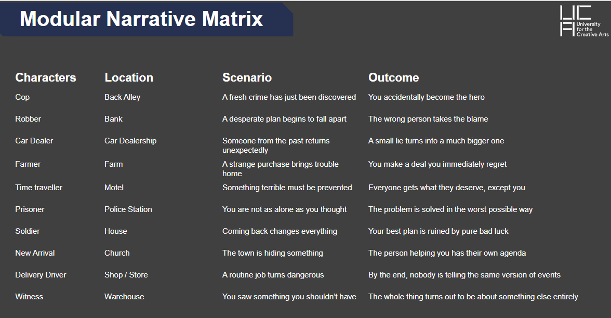

The basis of our game is that the player is a cop that is sent to investigate a town with suspicious activity and disapearances, upon arival the cop investigates the lone church as it's the only one with visible activity (lights being on). Upon investigating the church they find a secret entrance to an underground area behind the lectern. The player enters into the underground and stumble across a prisoner that lets them know of a key further inside the underground to rescue them. They then go further into the level, shooting enemy cultist, complete a puzzle and kill the boss before recieving the key, returning to the prisoner and being able to choose if they want to free the prisoner. If the player is able to find notes that key them in on the fact that the prisoner has some sort of parasite that will bring on the end of the world when freed and the player unlocks the choice to leave the prisoner for a different ending. 

# Week 1:

For this project I took up the role of being the project cooridenator and I took up emailing all members that werent in our monday class, creating the discord server and assigning roles to each teammate. 

Heres the email I sent out to my missing teammates:

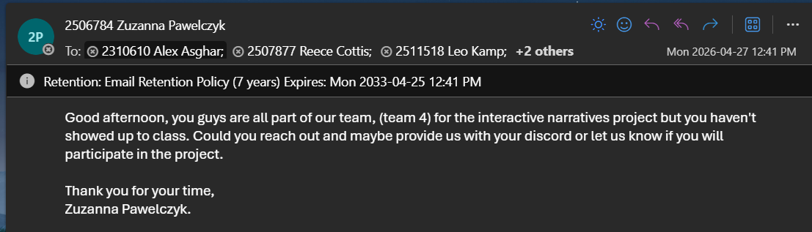

The discord server:

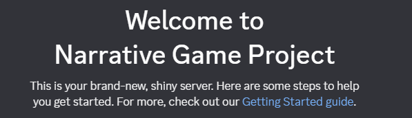

With all the teammates that responded I assigned roles to every teammate:

    Zuzanna (Me) - Programmer
    Thomas - Script Writer, Ideas Generator
    Dara - Concept Artist/Level Designer
    Leo - 3D Artist
    Muhammed - Animator
    Aaron - Animator
    Reece - 3D artist/Textures
    Stuart - Level Designer

Theo and Emmy responded that either they are no longer in the course or not meant to do the course. Alex and Mitch after day one stopped responding and interacting with the team, despite attempts to reach out. 

As Mitch originally made the github repo and then ghosted us for the first three days we did not have a shared repo with the hope that he would send the repo invites and join the server soon, so on Wednesday of the first week I finally took initiative to make a repo myself and send collaberation invites to everyone in my group. 

Me creating the repo (My nickname is Blue that I use more often than my irl name):

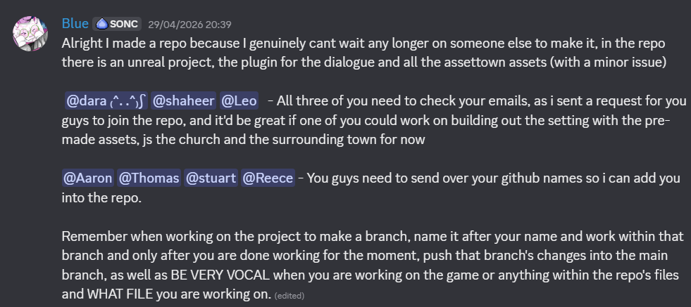

Every week I would @ everyone and check if everyone has something work on and track if development is progressing smoothly. 

Week 1's check in:

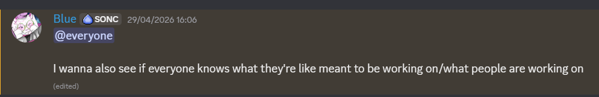

## Research

Knowing what the game plot will be I did some research on games and videos that can I use as inspiration and help behind our game. Looking into other horror games allows us to observe what makes a horror game successful and how to create the worldbuilding and aesthetic of a horror game. 

## Game Sources

### Left 4 Dead 2:

Left 4 Dead 2 is a game developed by valve where the players are tasked with getting from one point of the map to another point of the map while killing zombie enemies. This game was my main inspiration for our enemies, for how the enemies once viewing the player run at the player to attack them, forever locked onto the player until they are killed. 

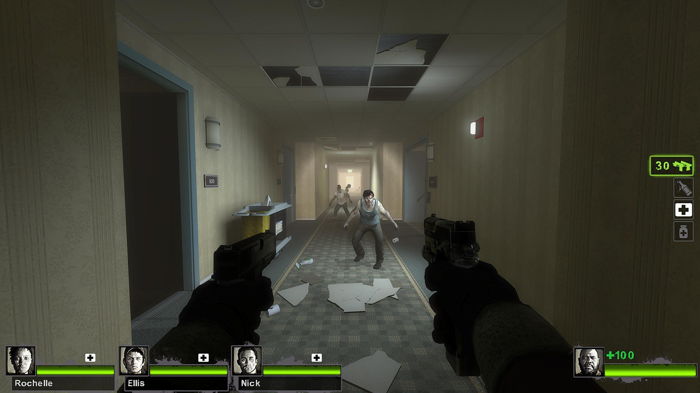

Most other games that were researched were to nail down the aesthetics and story idea for the game. 

### Silent Hill:

Silent Hill is a game created by Team Silent that focuses on being a surivial horror game with themes of cults and psychological horror. We used Silent hill as an example for the aesthetis of the game like the fog surrounding the player or the way the game has enemies almost human but disturbing as inspiration for our boss enemy.

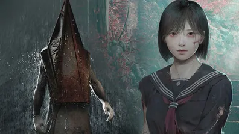

### Resident Evil:

Resident Evil created by Capcom was our very first inspiration for making a horror game in the first place, with the way narrative and story is written in Resident Evil. It inspired the narrative of a cop exploring a desolate area and the general horror aesthetics.

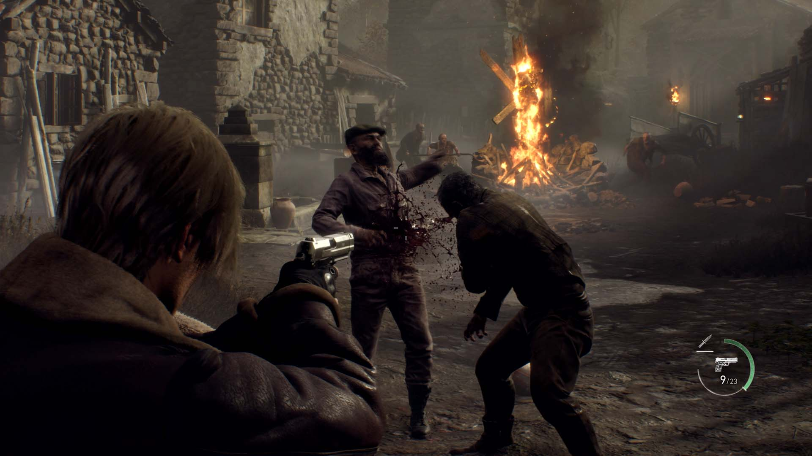

## Youtube Sources

(How to Make a Simple Behavior Tree in Unreal Engine 5 - Advanced AI) - I used this video to help me with creating the Enemy Ai, it being able to see the player and chase them.

(The Easiest Way to Make a Simple Enemy AI in Unreal Engine 5) - I used this video as another video to help me with the Enemy Ai and it's ability to seeing the player and chasing them. 

(Unreal Engine 5 Tutorial - AI Part 5: Hearing Perception) - With this video I was able to make the Ai's have the ability to hear the player and check that area. 

(Smart Enemy AI | (Part 1: Behavior Trees) | Tutorial in Unreal Engine 5 (UE5)) - More help with the AI enemy and how to fix my issues with the seeing and moving to players. 

(How To Make A 3D Interaction Prompt In Unreal Engine 5 (Tutorial)) - Reminder and help for the interaction between player and objects, as well as making a UI prompt for the player to see and know to interact with. 

(How To Interact In Unreal Engine 5 | How To Use Blueprint Interfaces In Unreal Engine 5 (Tutorial)) - More help with a reminder on how to use ther interaction system within Unreal.

(How To Add Third-Person Aiming Using Aim Offset - Unreal Engine 5 Weapon System Tutorial) - Help with how to make the player aim up and down with the mouse for the gun aiming. 

(Unreal Engine Tutorial-How to add flashlight to your game) - Helped on making a flashlight for the player. 

## Week 1 Implementation

For the first few days I worked on a separate unreal project to practise critical elements of the game before working in the unreal project of the actual game. I first explored the dialogue plugin we were given to work, using the doccumentation provided with the plugin template. 

Exploring the Dialogue Graph:

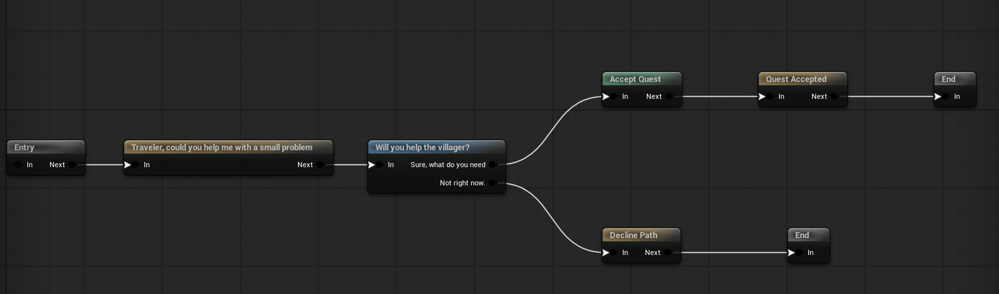

The Dialogue graph and the Dialogue widgets working:

Next I worked on the AI enemy needed for the game, and after a bunch of different video tutorials I landed on a version of the Ai Enemy which I could replicate later in the game project. The enemy pawn contains an Ai controller and a Blackboard, within the Blackboard there are different tasks the Ai sifts through depending on different conditions. 

The Ai's Blackboard:

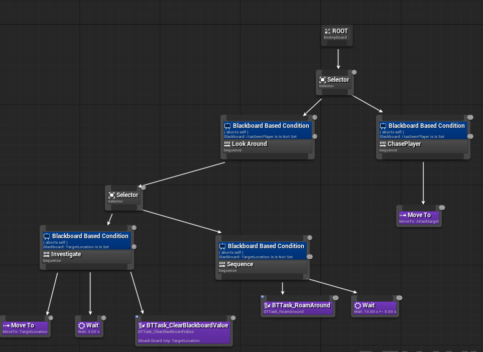

The Ai enemy contains an Aiperception component that when the player walks into the Ai's view it sets the value of what object the Ai should track to be the player so that the condition in the blackboard is changed to chase the player. 
Another value that the Ai is able to track is upon target perception updated, it updates the variable of where the player is within the blackboard for the ai enemy to walk to the area where the ai enemy heared the player. This allows the Ai enemy to in a way "hear" the player.

The hearing function: 

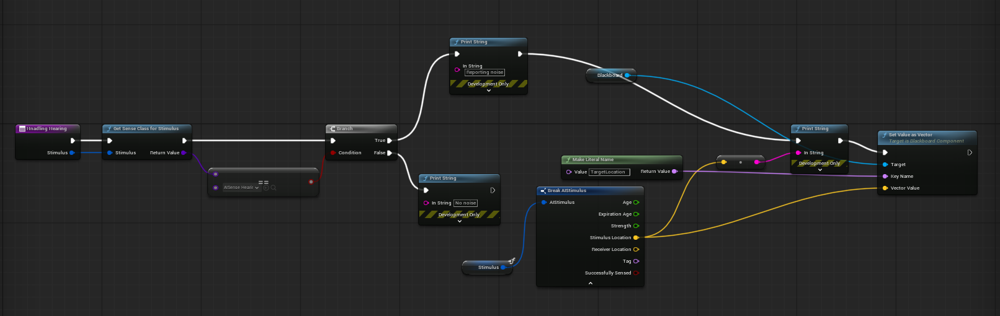

Next I worked on adding the gun to the player and the ability to aim. With my old games as help for implementation. For the player to be able to hold and aim with the gun, I had to create a whole new Animation blueprint and altercating AO_Pistol so that the values are able to match up properly and aim correctly. 

Alteration of AO_Pistol for aiming:

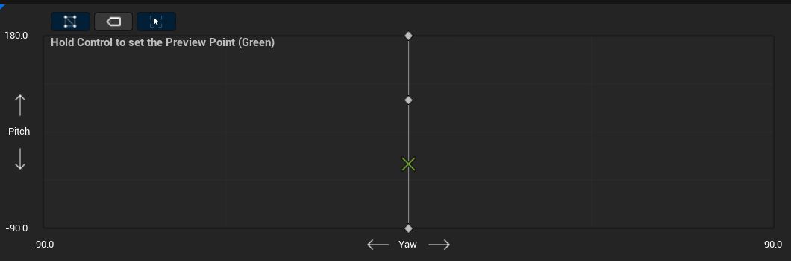

The Animation Blueprint of the pistol holding:

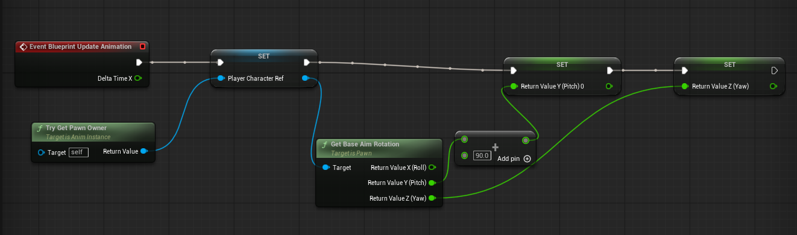

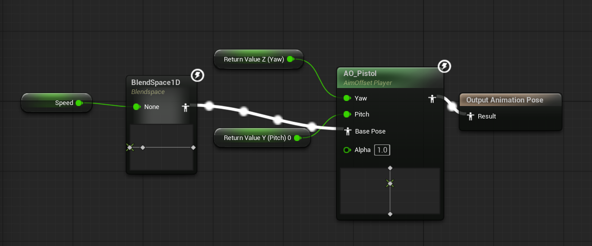

The Blend1D blends three animations of Pistol Idle, Pistol Walk and Pistol Run together to allow the player to Idle, Walk and Run with the gun. 

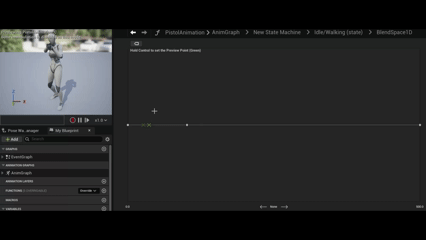

Lastly I worked on the logic of the puzzle, with a rotating cube with different sides, being able to interact with the cube and rotate sides. 

Checking for the rotating logic when clicking the interact button (E). 

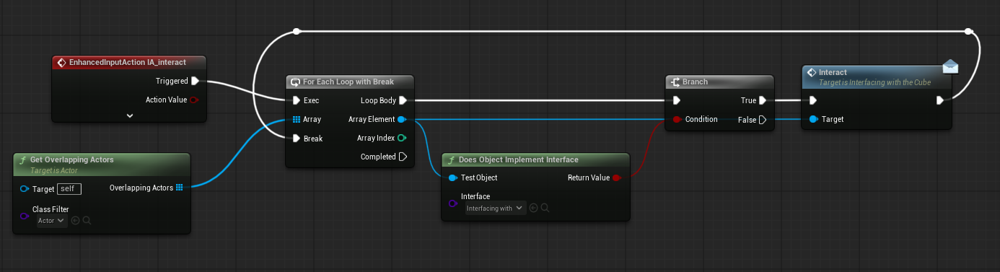

The logic of the cube's rotation:

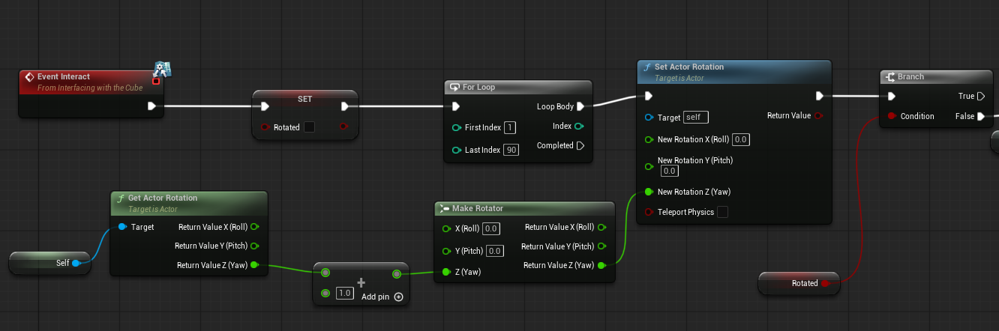

# Week 2

After our meeting with Liam and Assad we were suggested to make a Click up to keep track of everyones tasks so thats we did right after the call. I asked Thomas to create a click up group because I have never used the website before to know how it works and we started on delgated tasks on the website.

Click up:

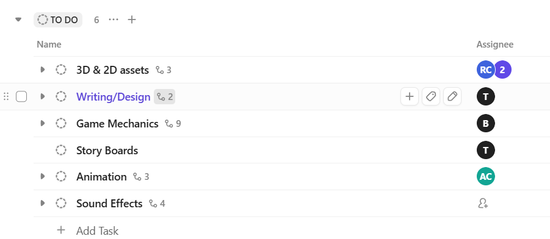

With the repo up and running, and Dara and Reece built out the simple version of the levels I was able to start working on implementing game mechanics into the actual project. However alongside this we kept having major github issues where things would unexplainedly corrupt and delete files so I had to find a way around this and also teach all my teammates to the same thing, so now we keep backup files of everything we do to fix any conflict issues we end up having. 

Example of the underground level corrupting and me having to replace it right after a merge:

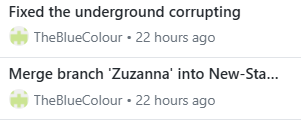

## Week 2 Implementation:

I started working in the actual project rather than on a practise unreal project.

In week one (On Sunday) I added the very basic enemy into the game project before then the following Monday I Implemented the proper Ai and blackboard into the game unreal project, with the changes made of the practise version. As in my practise I gave the Enemy, AI perception so that upon seeing the player the value in the blackboard changes and triggers the Enemy to Chase the player. In the Chase Player section it reads the value of where the player is, moves to the value, focuses on the player so that every time it attacks it attacks in the correct direction of the player, attacks (which is an animation montage thats triggered) and then waits before repeating the process. If the Enemy doesnt see the player, instead of roaming it just stays in it's spot, and when the player walks into it's perception circle the value of where they heard the player will update and make the Enemy walk and check that area, if they are unable to find anything that triggers their viewing, they will then return back to their original point on the map, moving across a nav mesh. 

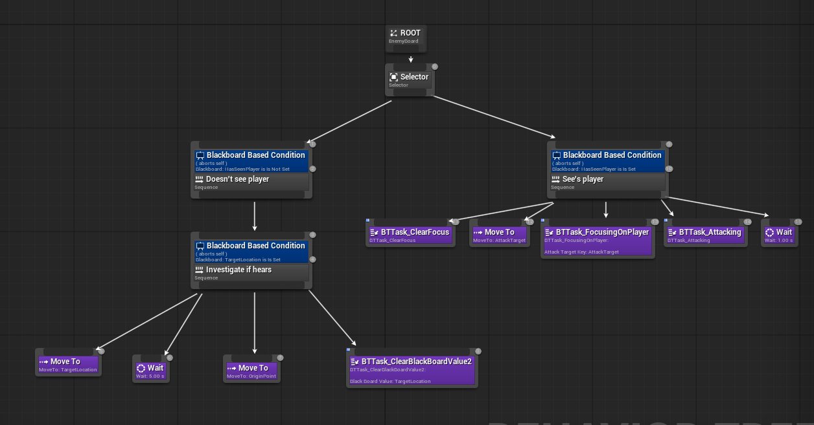

When the Enemy calls the attack task, it plays the attack montage, which contains animnotifs that call the sphere trace until the end animnotif. I altered the base unreal skeleton to have two sockets, one at the hand and one at the shoulder for the start and end of the sphere trace, using 20 as the radius checking if it's overlapping a pawn specifically (assigning the enemy to not be a pawn so that the enemies can not kill each other) and then assigning 10 damage to the player when overlapped with them. 

The Attack Sphere trace: 
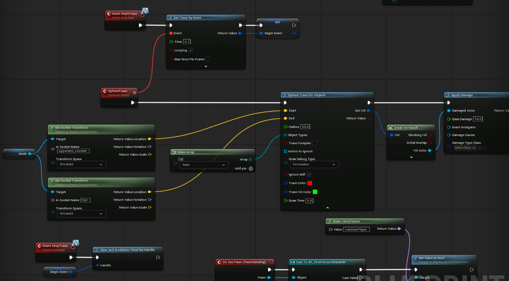

The enemy is able to take damage as well, and when the health reaches zero or below the enemy destroys itself. 

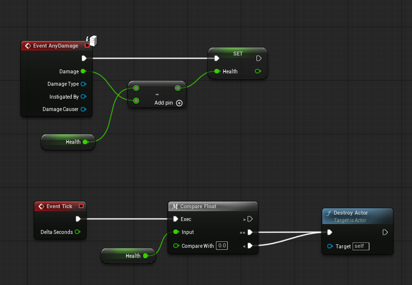

With the Enemy Ai in the game, I had to create a second Enemy Ai for the Boss as the boss would contain different logic from the basic Enemy. Inside the Boss Ai instead of having Three states where the Enemy stands, hears or see, the Boss has four different mstates. The Boss is initially stationary, when the player opens up the Boss arena and walks into it's sight (made with again an Ai perception in the Ai controller) it goes into a random variable state that randomises between true or false, if the value is false it goes into Attack state, if its True it goes into Shoot state. In Attack state it moves towards the player and then plays an animation to attack the player (just like the basic enemy). Here, Muhammed helped me with making the boss focus and aim at the player correctly as for unknown reasons the boss would lock onto one specific spot instead of the player. In the shoot state, the boss plays an animation as a notify before shooting, before then shooting with the start being where the boss is and the end being where the player was a fraction of a second ago so that it allows room for the player to move out the way. 

Boss Blackboard:

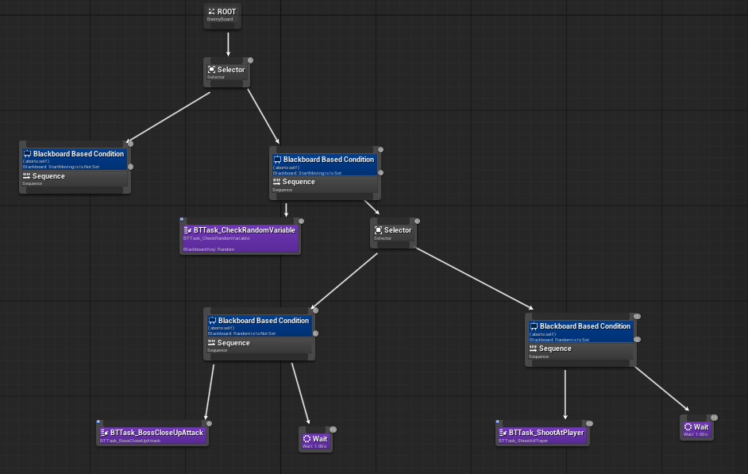

Bosses Shoot State:

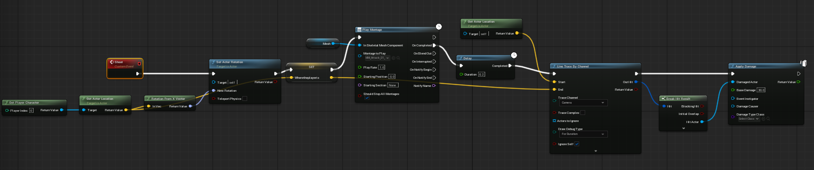

I then used my practise version of the gun holding, aiming and shooting and remade it into the game, I was able to more accurately fix the aiming up and down of the gun without having to alter numbers awkwardly or have the animation break in anyway.

The Aiming blend, where the wrists are no longer snapped like in the practise version:

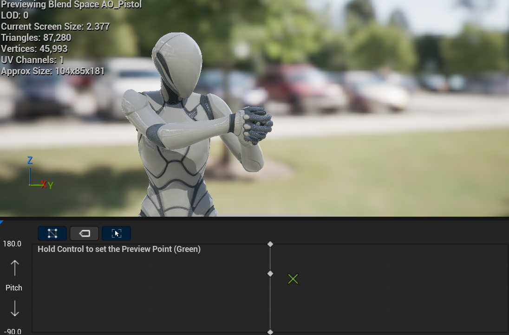
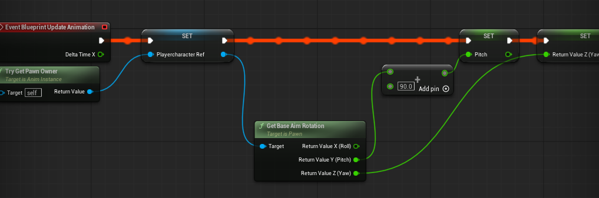
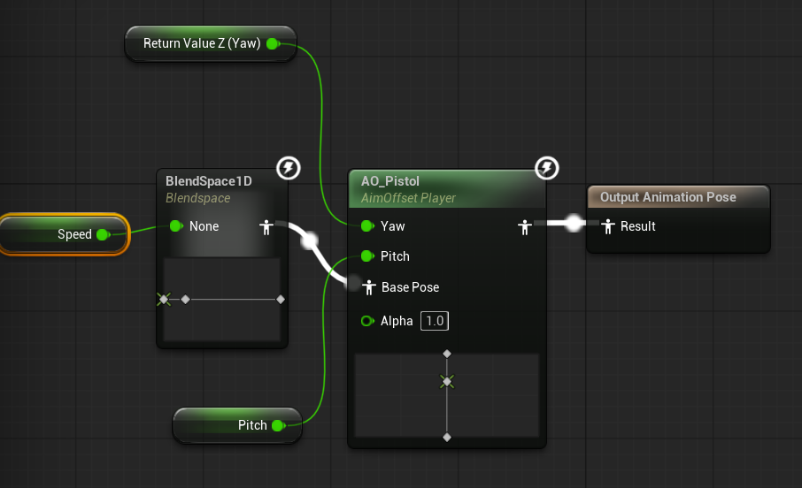

Within the player character, an Event tick runs checking if the shooting amount the player has against zero and if its equal or smaller than zero it starts reloading taking 5 seconds to reload before changing the shoot amount back to 10, while the shooting amount is zero the player cant shoot and must wait for it to reload. I also made an Input in the players Inputs where if they right click they can manually reload the gun from any amount of bullets left.

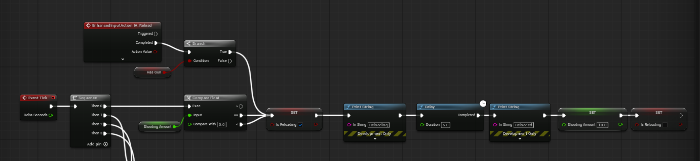

In the Event tick it checks the player's health continiously, if it drops below 100 it go into the state of healing, healing one health every 1 second and it stops healing once it reaches 100.

With some of the script haven been written at this point, I got to work on one of the critical dialogue interactions in the game being between the player and the prisoner about the key in the game. I made the dialogue be triggered seperately walking into a box colision that then triggers the dialogue. In the dialogue graph there's a set condition that triggers an event that switches the camera point of view to create a more cinematic view, as well as in Week 3 I altered the trigger to also make the player model disapear and display the model used for cutscenes. The reason these two models are seperated is because the player model needs detailed enough hands for the gun to not look weird being held but in cutscenes we want the "canonical" version of the character we're playing as, so these two are seperated and triggered by events depending on if the player is a cutscene or playing to display which model. The prisoner has multiple dialogue options but only one that progresses and gives the player the quest which is to find the key underground, the rest of the dialogue choices serve as plot. Right before the cutscene ends (the end node) there's another set condition that triggers the camera to change back into the first person camera of the player to allow the player to control the character in first person mode again. The dialogue trigger that puts the player in the cutscenne deletes itself after being triggered once so the player can not experience the same cutscene twice.

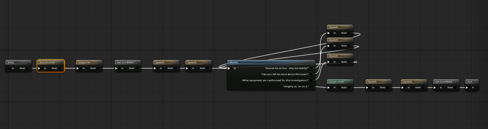

As the church seen was created and set up I was able to start adding some of the interactables in the church, mainly allowing the doors to open when being interacted with. Simply done with an interface that when interacted with makes the door rotate open. In Week 3 I added dialogue when the doors are open, and made it specifically so that after one open the dialogue can not be triggered again with opening and closing the doors, this persists even if you change levels and reopen the level with the game still active, as originally the player was going to walk through the church doors again after leaving the underground but that was scrapped. 

Doors:

Behind the altar I added a placeholder plane as a trapdoor that when interacted with teleports the player to the Underground area. In Week 3 I added dialogue that triggers a set condition that makes the trapdoor play an animation (created by Muhammed) before triggering the event that takes the player to the Underground level. The player is also then given the chose to say no to going underground and looking around a bit more first. 

I added the puzzle I created in the practise unreal version into the project, leaving the same logic behind it spinning and the way depending on which way it's spun it gives a number, and when the specific number combination between the four pillar is set, the door opens (it checks the correct numbers every tick). I was able to fix the issue of it spinning too many times upon one button press and that was as simple as connecting the button press to be on completed rather than on pressed.

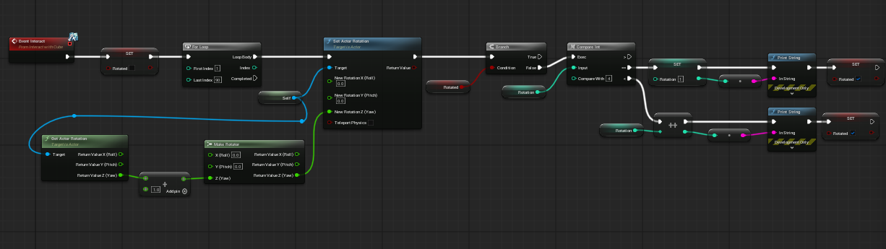

Here's also an example of the interaction of things on the wall as well as the rotating objects:

I made the notes be interactable with an interface, when pressed E it opens the widget of the note and when pressing shift it closes the widget. For some reason I run into an issue where I can not set game paused when these widgets are open otherwise you just can't click any inputs, and i fixed this by simply not having the notes pause the game anymore. I also added the key to spawn after the boss fight is defeated which later unlocks the dialogue to the ending of the game, as well as interacting with all three notes around the level unlocks the player's ability to get a different ending. 

As I had the dialogue for the very cutscene but no area to play it out, I reshaped the Lvl_FirstPerson area (as it automatically sets itself as the first level player's play) to look like an office with the assetville pack and decorated it a little look more like an office as well as adding in the sherrif and giving him a skeleton and animation so that he's not t-posing (though he wont move around anywhere). With the cutscene, I set it up simiarly to the prisoner dialogue, whereas the dialogue triggers automatically upon loading the level (it checks different variables to check which dialogue set to play) and  (here's where the similarities start) the set condition automaticaly sets the player's camera to a set camera in the level. The player is never given autonomy in the office level and only views the level from that angle. There's another set condition that then triggers when the player finishes the dialogue to send them to the first level of the church.

I gave the player a spotlight to serve as a flashlight, which by pressing the F button, through a flip flop function it switches between going on and off.

# Week 3

When attempting to build the game that week to check if everything would work, I ran into an issue where all the set condition nodes would not trigger in the game, so I reached out to Liam and he had fixed the plugin. 

## Week 3 Implementation

With Week 3 I ended up impleneting alot of dialogue for the player interacting with things, some mentioned earlier in the dev log. Some others that I added were interaction with:
- The blood on the floor
- The tipped over benches
- The scratches on the walls of the church
Unlike the church doors, the text can be trigger multiple times over. I did notice an issue of where it's a little unclear for the player what they can interact with, so I added a widget that displays "interact" on screen everytime a player walks into the collision box of an item they can interact with, when they leave that box the text disapears. However there's an additional issue where the player isn't really aware of what they are looking at when interacting with things if they are not looking directly at the object of interest. 

I was able to add a bunch of black loading screens in the game, for example at the start of the first cutscene, where there is a set condition to make the black screen disapear, as well as when transitioning to the Church level there's a black screen with an animation that has both the black screen and the text fade out. 

With the endings finally written up I was able to add the endings in the game as well, have it be a dialogue trigger that checks if the player has the key and also if the player has interacted with all three of the notes. If the player has interacted with the key but not with all the notes, they are sent to one version of the dialogue where they can only save the prisoner, which opens the door (deletes it) and then makes the prisoner follow the player. The player then has to return back to the entrance of the Underground (with the prisoner following them) and because they have the key the teleported is triggered to send them back to the office and trigger ending A, with it's specific dialogue. In ending A there's set condition nodes that trigger the sky outside to turn red and the screen to shake, both of those things were made by Stuart and handed to me so i could connect them to be on the event and not on beginplay. The dialogue then triggers for the ending screen to fade in, showing text that gives extra context to the ending and allows the player to exit the game.

If all three notes are collected the trigger instead sets a different dialogue, where the player is able to pick between saving the prisoner or leaving them behind, leaving them behind triggers Ending B that has it's own dialogue, and then triggers it's own ending screen with a different ending and also allowing the player to end the game.

Additionally I made all the menu screens for the game, the start menu, death screen, a menu for the controls as well the pause menu. The start menu always triggers at the beginning of the game, even if you die and restart the game, the start menu allows you to to play the game, check the controls which its own widget, check the credits which is also it's own widget and then exit the game. The pause menu is similar but the player is able to trigger it at any point they want with clicking the P button, it will pause the game no matter where they are and they can choose to continue, check the controls, credits or leave the game. The death screen triggers if the player has reached zero health or less, and displays that the player has died and allows them to exit the game or play again. As well as I did the ui for the Health and Ammo, which their display texts takes from the player character. 

Get Text example for the Ammo, which displays "reloading" when the player is reloading or the amount of ammo they have:

# Week 4

During Week 4, we were able to play test a bunch of different games as well as have people playtest out game, unfortunately I did not get that many playtests, but some is always better than none and was able to tell us some issues with the game that we can tackle to fix before the deadline.

## The playtest result

The playtest allowed us to observe that the game has too many enemies and that it overwhelms the player so we removed some of the enemies, as well as one of the notes in the game, I forgot to remove the logic where it pauses the game so the players assumed that the game. Whereas in reality it was just pausing the gameplay and not letting them use the shift button as its meant to, so I was able to fix that.

I also noticed that the players had a hard time seeing the decals on the puzzles in the puzzle room, so we altered the textures and the lighting in the room to make it easier for the player, as well as I forgot to remove the ability to shoot and kill the prisoner which I then removed.

Overall, the players enjoyed the genre style and graphics of the game that we chose, and enjoyed the game overall despite the minor issues.

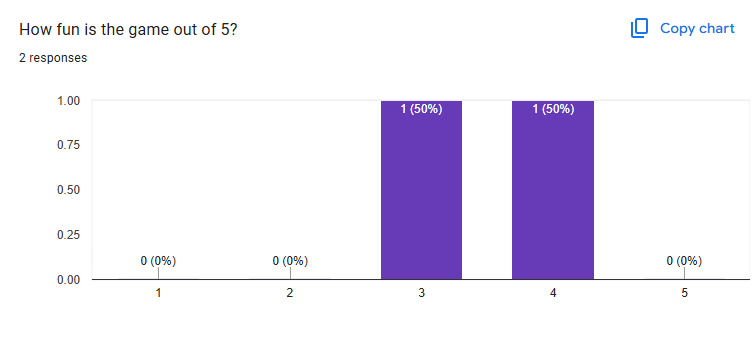
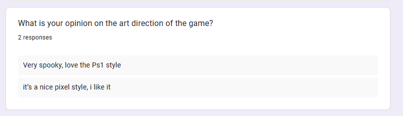

## Reflection

Overall, I am quite proud of the game, and the progress that was done I think the game is very fun, I just wish we had more animations in the game that are unique to the game and not unreal premade animations. I think I did a pretty solid job at managing the project and staying up to date with all my teammates on what they are doing, and how much we can get done in the time we have, there are some people that did not communicate well back and from that we are missing alot of potential in animations we could have had as well as the boss fight is lack luster, but there's only a certain amount of times I can yell at people to do work and it means nothing if they don't listen anyways. Between the teammates that were responsive and did their work, I think I was able to spread the work load amongst everyone rather equally, except for the amount of coding I had to do (as one of our developers just stopped responding), aside from that I think everyone who did put in work, put in substational amount of work in. Though personally, I wish I could have added in more gameplay, make it a little more complicated, and a third Enemy ai as it was originally planned as I didnt get to doing that.

Some examples of me communicating to my teammates as proof:

### Our voice call in Week 1 we had to delegate on what to do and what tasks to be done:

### Me communicating about meetings/tasks to do with the class:

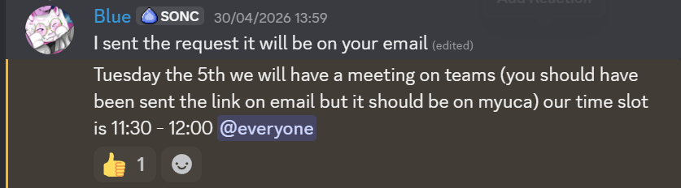
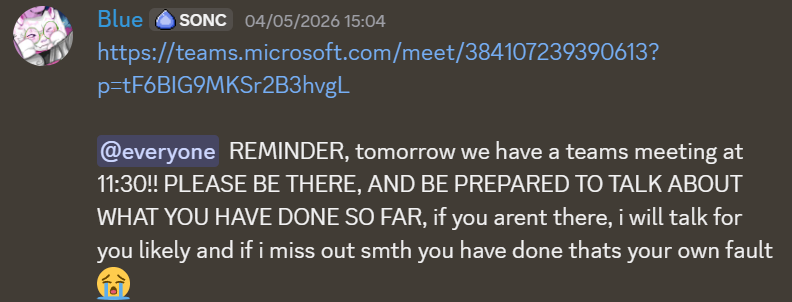

### Me assigning tasks to my teammates:

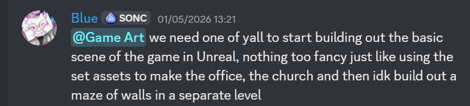

### Telling my teammates how to use Github (and also I helped alot of my teammates with the corruption issues we've been having with Github):

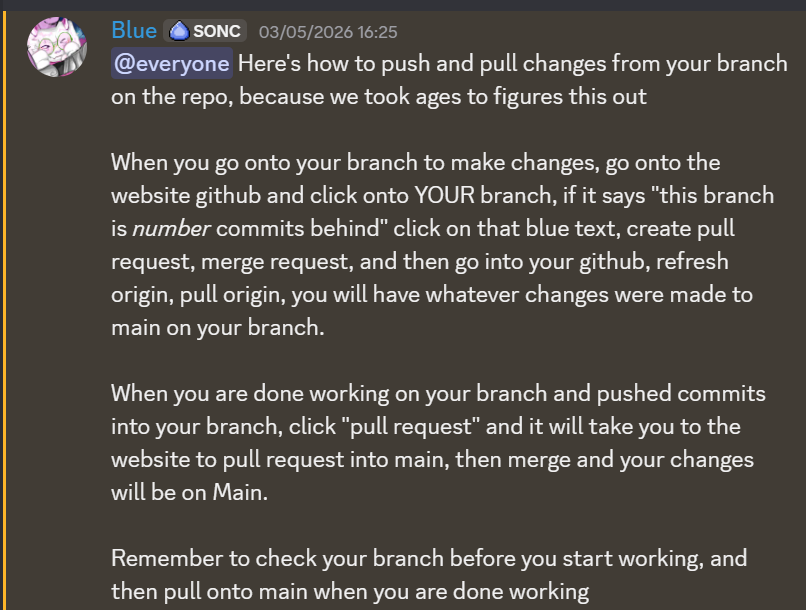

### Everytime I have asked to check for progress:

### Week 1-
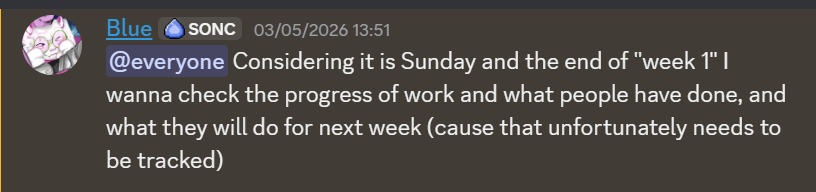

### Week 2-
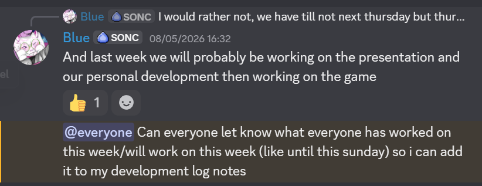

### Week 3-
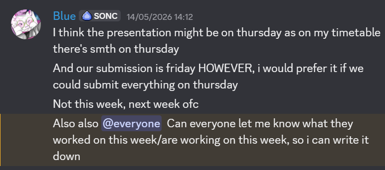

## Bibliography

Resident Evil 4 on Steam (s.d.) At: https://store.steampowered.com/app/2050650/Resident_Evil_4/ (Accessed  14/05/2026).

SILENT HILL f on Steam (s.d.) At: https://store.steampowered.com/app/2947440/SILENT_HILL_f/ (Accessed  14/05/2026).

Left 4 Dead 2 on Steam (s.d.) At: https://store.steampowered.com/app/550/Left_4_Dead_2/ (Accessed  14/05/2026).

How to Make a Simple Behavior Tree in Unreal Engine 5 - Advanced AI - YouTube (s.d.) At: https://www.youtube.com/watch?v=QJuaB2V79mU&list=PLLW3PN8ZDyTWd_f3y-YScCPx-VOfzyssJ&index=6 (Accessed  14/05/2026).

The Easiest Way to Make a Simple Enemy AI in Unreal Engine 5 - YouTube (s.d.) At: https://www.youtube.com/watch?v=3XuEFmpUJeI&list=PLLW3PN8ZDyTWd_f3y-YScCPx-VOfzyssJ&index=7 (Accessed  14/05/2026).

Unreal Engine 5 Tutorial - AI Part 5: Hearing Perception - YouTube (s.d.) At: https://www.youtube.com/watch?v=OytuX_swh8M&list=PLLW3PN8ZDyTWd_f3y-YScCPx-VOfzyssJ&index=9 (Accessed  14/05/2026).

Smart Enemy AI | (Part 1: Behavior Trees) | Tutorial in Unreal Engine 5 (UE5) - YouTube (s.d.) At: https://www.youtube.com/watch?v=-t3PbGRazKg&list=PLLW3PN8ZDyTWd_f3y-YScCPx-VOfzyssJ&index=10 (Accessed  14/05/2026).

How To Make A 3D Interaction Prompt In Unreal Engine 5 (Tutorial) - YouTube (s.d.) At: https://www.youtube.com/watch?v=kB1_qxNUi9Q&list=PLLW3PN8ZDyTWd_f3y-YScCPx-VOfzyssJ&index=12 (Accessed  14/05/2026).

How To Interact In Unreal Engine 5 | How To Use Blueprint Interfaces In Unreal Engine 5 (Tutorial) - YouTube (s.d.) At: https://www.youtube.com/watch?v=5-UJT4U-jeg&list=PLLW3PN8ZDyTWd_f3y-YScCPx-VOfzyssJ&index=13 (Accessed  14/05/2026).

How To Add Third-Person Aiming Using Aim Offset - Unreal Engine 5 Weapon System Tutorial - YouTube (s.d.) At: https://www.youtube.com/watch?v=9T_Ya1_Vveg&list=PLLW3PN8ZDyTWd_f3y-YScCPx-VOfzyssJ&index=14 (Accessed  14/05/2026).

Unreal Engine Tutorial-How to add flashlight to your game - YouTube (s.d.) At: https://www.youtube.com/watch?v=AlnBVwVPMT8&list=PLLW3PN8ZDyTWd_f3y-YScCPx-VOfzyssJ&index=15 (Accessed  14/05/2026).

All assets/audio in-game are either created by my teammates, are premade unreal assets, or were sourced from Fab. 
